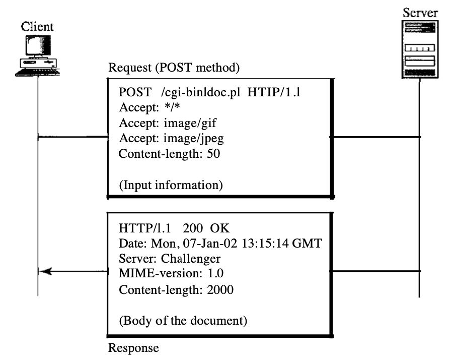

# Purpose of Project

The goal of this project is to understand how HTTP works under the hood. When learning frameworks like `Express.js`, we directly use HTTP servers provided by the libraries. This project gives us insights into what happens under the hood by manually implementing the HTTP server-client communication using raw sockets and TCP.

## Sockets, TCP, and HTTP

- **TCP (Transmission Control Protocol)**:  
  TCP is a connection-oriented protocol that works at Layer 4 (Transport Layer) of the OSI model. It ensures reliable communication between two hosts. If any packet is lost or incorrectly ordered, it is TCP's responsibility to handle such issues and ensure the data is transmitted correctly.
  
- **Sockets**:  
  Sockets are endpoints used for communication in a TCP connection. A socket allows data to be sent and received over a network between a client and a server. TCP traffic passes through these sockets to establish a connection.

- **HTTP (Hypertext Transfer Protocol)**:  
  HTTP is an application-layer protocol built on top of TCP. It enables the structured exchange of data between clients (typically web browsers) and servers over the web. HTTP defines a request and response format:

    ### HTTP Request Format
    ```
    ------------------------------------------------------------
    |                Request Line                              |
    |   (Request_Method <Space> URL <Space> HTTP_Version)      |
    ------------------------------------------------------------
    |                Headers                                   |
    |                                                          |
    ------------------------------------------------------------
    |                Blank Line                                |
    ------------------------------------------------------------
    |                Body (optional)                           |
    ------------------------------------------------------------
    ```
    - **Request Line**: This includes the `Request_Type`, `URL`, and `HTTP_Version`.  
    - **URL**: Specifies the `Method://Host:Port/Path` from where the client wishes to fetch data.

    ### HTTP Response Format
    ```
    ------------------------------------------------------------
    |                Status Line                               |
    |   (HTTP_Version <Space> Status_Code <Space> Status_Desc) |
    ------------------------------------------------------------
    |                Headers                                   |
    |                                                          |
    ------------------------------------------------------------
    |                Blank Line                                |
    ------------------------------------------------------------
    |                Body (optional)                           |
    ------------------------------------------------------------
    ```
    - **Status Line**: Contains the `HTTP_Version`, `Status_Code`, and `Status_Phrase`.

    

## Coding Notes

- **Dependencies**:  
  To implement socket programming on Windows, you'll need to use `winsock2.h` and `ws2tcpip.h` libraries.

- **Client-Side**:  
  In `client.cpp`, only the **client socket** is created. The following socket functions are used:
  - `send()` and `recv()` utilize the **client socket**.
  - `connect()` uses the **client socket** to establish a connection with the server.

- **Server-Side**:  
  In `server.cpp`, both **client** and **server sockets** are used. The functions on the server side are:
  - `send()` and `recv()` also use the **client socket** for communication.
  - `bind()`, `listen()`, and `accept()` work with the **server socket** to bind it to a specific port, listen for incoming connections, and accept the connection once a client attempts to communicate.

### Flow of the Communication

1. **Server-Side**:
   - The **server socket** is bound to a specific port and IP address.
   - The server listens to the port to wait for incoming client connections.
   - Once a client connects, a 3-way handshake occurs to establish the connection between the client socket and the server socket.

2. **Client-Side**:
   - The client socket sends an HTTP request to the server. This includes data such as the HTTP method, URL, and any headers or body content.
   - The **server socket** parses the request, generates an appropriate response, and sends it back to the client.
